# VMRay Feed and VMRay Enrichment For Microsoft Sentinel

**Latest Version:** beta - **Release Date:** 

## Overview

## Requirements
- Microsoft Sentinel.
- VMRay Analyzer, VMRay FinalVerdict, VMRay TotalInsight.
- Microsoft Azure
  1. Azure functions with Flex Consumption plan.
     Reference: https://learn.microsoft.com/en-us/azure/azure-functions/flex-consumption-plan
  2. Azure Logic App with Consumption plan.
     Reference: https://learn.microsoft.com/en-us/azure/logic-apps/logic-apps-pricing#consumption-multitenant
  3. Azure storage with Standard general-purpose v2.

## VMRay Configurations

- In VMRay Console, you must create a Connector API key.Create it by following the steps below:
  
  1. Create a user dedicated for this API key (to avoid that the API key is deleted if an employee leaves)
  2. Create a role that allows to "View shared submission, analysis and sample" and "Submit sample, manage own jobs, reanalyse old analyses and regenerate analysis reports".
  3. Assign this role to the created user
  4. Login as this user and create an API key by opening Settings > Analysis > API Keys.
  5. Please save the keys, which will be used in configuring the Azure Function.

     
## Microsoft Sentinel

### Creating Application for API Access

- Open [https://portal.azure.com/](https://portal.azure.com) and search `Microsoft Entra ID` service.

- Click `Add->App registration`.

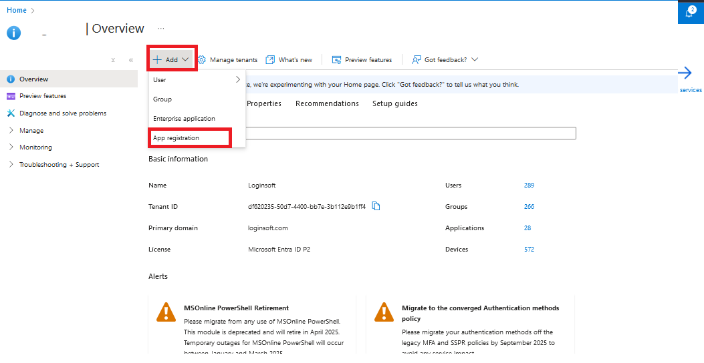

- Enter the name of application and select supported account types and click on `Register`.

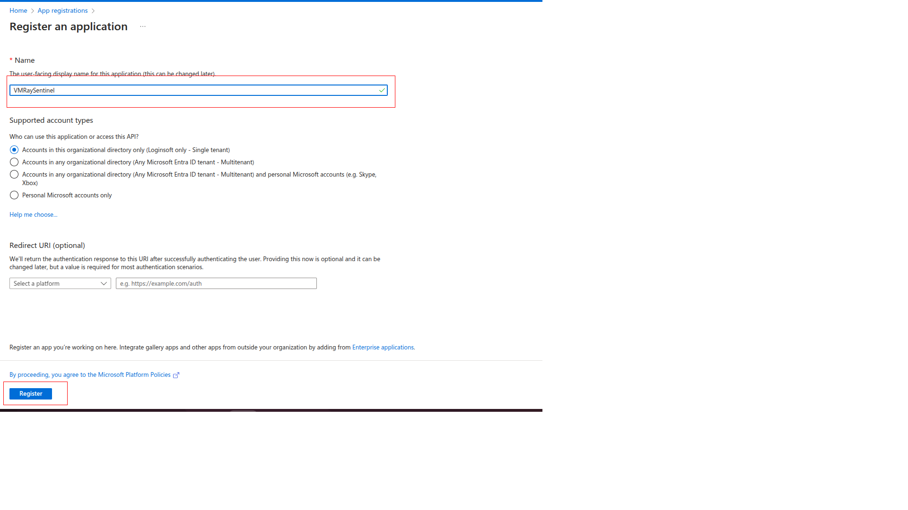

- In the application overview you can see `Application Name`, `Application ID` and `Tenant ID`.
 
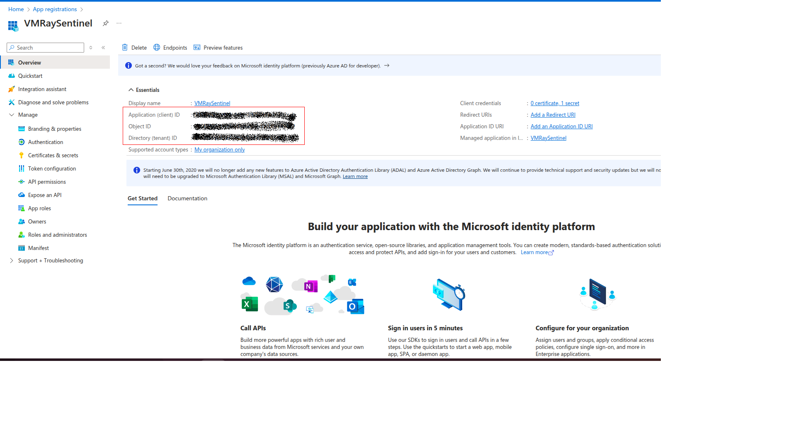

- After creating the application, we need to set API permissions for connector. For this purpose,
  - Click `Manage->API permissions` tab
  - Click `Microsoft Graph` button
  - Search `indicator` and click on the `ThreatIndicators.ReadWrite.OwnedBy`, click `Add permissions` button below.
  - Click on `Grant admin consent`

 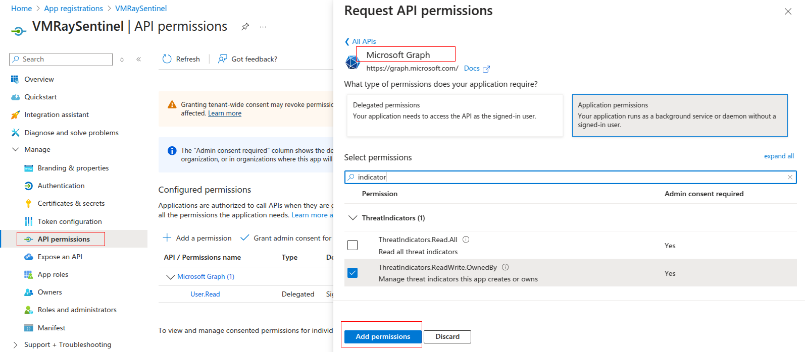 

- We need secrets to access programmatically. For creating secrets
  - Click `Manage->Certificates & secrets` tab
  - Click `Client secrets` tab
  - Click `New client secret` button
  - Enter description and set expiration date for secret

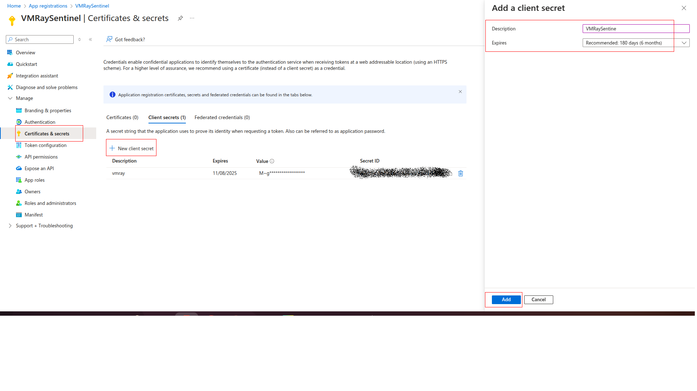

- Use Secret `Value` to configure connector.
  
 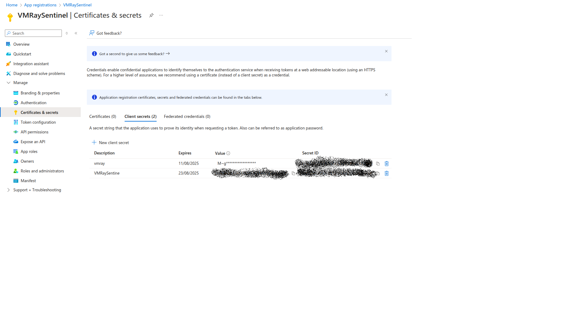

## Provide Permission To App Created Above

- Open [https://portal.azure.com/](https://portal.azure.com) and search `Microsoft Sentinel` service.
- Goto `Settings` -> `Workspace Setting`

- Goto `Access Control(IAM)` -> `Add`

- Search for `Microsoft Sentinel Contributor` and click `Next`

- Select `User,group or service principle` and click on `select members`.
- Search for the app name created above and click on `select`.
- Click on `Next`

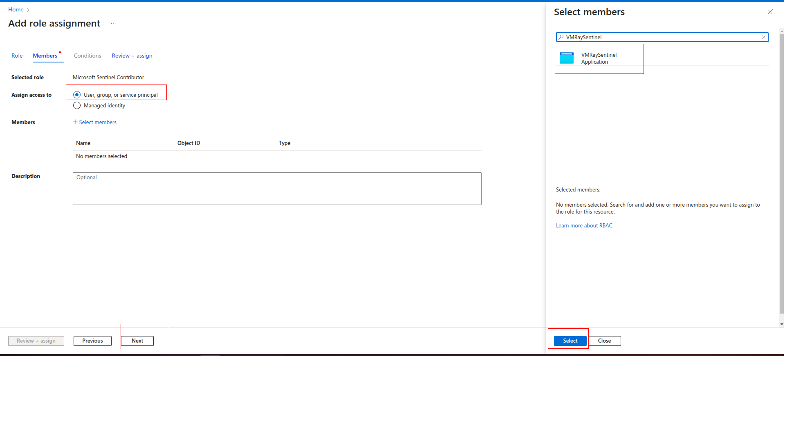

- Click on `Review + assign`

# Deploy VMRay Sentinel Feed App

- Click on below button to deploy VMRay Sentinel Feed app:

  

- It will redirect to feed Configuration page.
  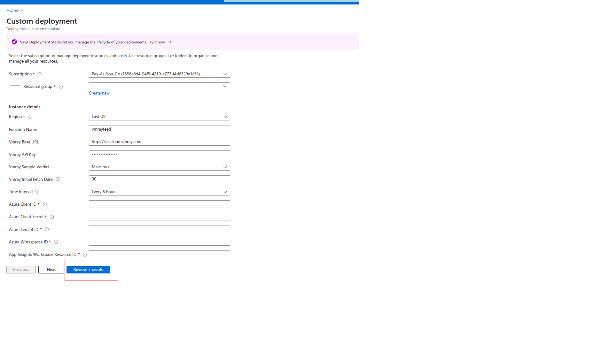
- Please provide the values accordingly.
  
|       Fields       |   Description |
|:---------------------|:--------------------
| Subscription		| Select the appropriate Azure Subscription    | 
| Resource Group 	| Select the appropriate Resource Group |
| Region			| Based on Resource Group this will be uto populated |
| Function Name		| Please provide a function name if needed to change the default value|
| Vmray Base URL | VMRay Base URL |
| Vmray API Key | VMRay API Key |
| Azure Client ID   | Enter the Azure Client ID created in the App Registration Step |
| Azure Client Secret | Enter the Azure Client Secret created in the App Registration Step |
|Azure Tenant ID | Enter the Azure Tenant ID of the App Registration |
| Azure Workspacse ID   | Enter the Azure Workspacse ID. Go to  `Log Analytics workspace -> Overview`, Copy `Workspace ID`, refer below image.|
| App Insights Workspace Resource ID | Go to `Log Analytics workspace` -> `Settings` -> `Properties`, Copy `Resource ID` and paste here |

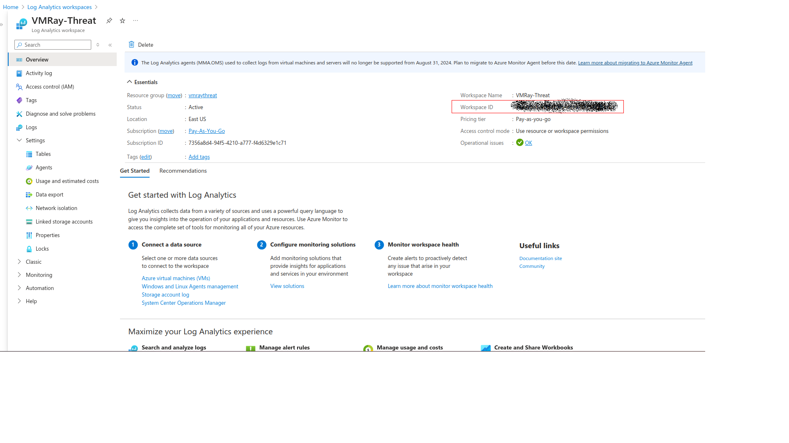

- Once you provide the above values, please click on `Review + create` button.

### Deployment of Function App Zip package
- Download the zip package from the `VMRayThreatIntelligence` folder.
- Open [https://portal.azure.com/](https://portal.azure.com) and search `Storage accounts` service.

- Open the storage account, the name starts with `vmraystorage`.
- Go to `Storage Browser` -> `Blob Containers`, click on container, the name starts with `vmraycontainer`.
- Click on `Switch to Access key`.

- Upload the downloaded zip package to the container. 

## Deploy VMRay Enrichment App
- Click on below button to deploy VMRay Sentinel Feed app:

  
  
- It will redirect to feed Configuration page.
  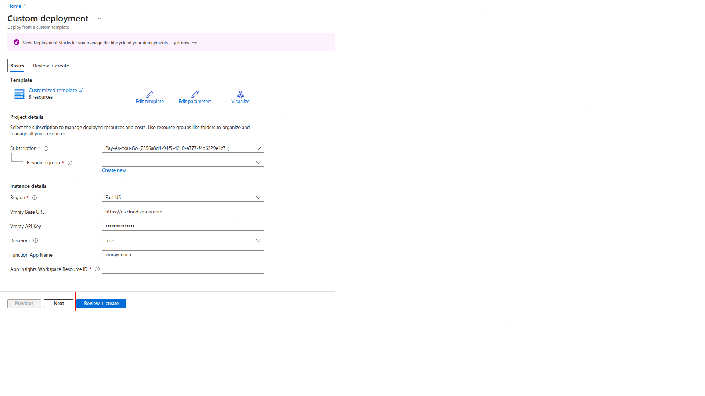
- Please provide the values accordingly
  
|       Fields       |   Description |
|:---------------------|:--------------------
| Subscription		| Select the appropriate Azure Subscription    | 
| Resource Group 	| Select the appropriate Resource Group |
| Region			| Based on Resource Group this will be uto populated |
| Function Name		| Please provide a function name if needed to change the default value|
| Vmray Base URL | VMRay Base URL |
| Vmray API Key | VMRay API Key |
| Resubmit   | If true file will be resubmitted to VMRay |
| App Insights Workspace Resource ID | Go to `Log Analytics workspace` -> `Settings` -> `Properties`, Copy `Resource ID` and paste here |

- Once you provide the above values, please click on `Review + create` button.

## Deploy VMRay Logic Apps
### Deploy `Submit-URL-VMRay-Analyzer`
- Click on below button
  

- It will redirect to configuration page
- please click on `Review + create` button

### Deploy `VMRay-Sandbox_Outlook_Attachment` 
- Click on below button
  

- It will redirect to configuration page
- please click on `Review + create` button

## Provide Permission to Logic app

- Open [https://portal.azure.com/](https://portal.azure.com) and search `Microsoft Sentinel` service.
- Goto `Settings` -> `Workspace Setting`

- Goto `Access Control(IAM)` -> `Add`

- Search for `Microsoft Sentinel Contributor` and click `Next`

- Select `User,group or service principle` and click on `select members` .
- Search for the Logic app name deployed above and click on `select`.
- Click on `Next` 

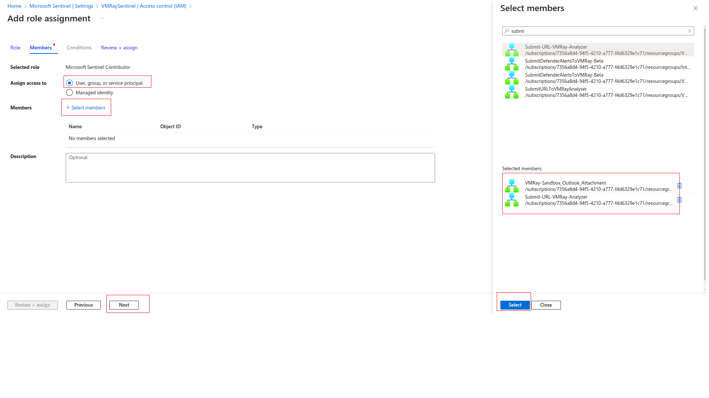

- Click on `Review + assign`

